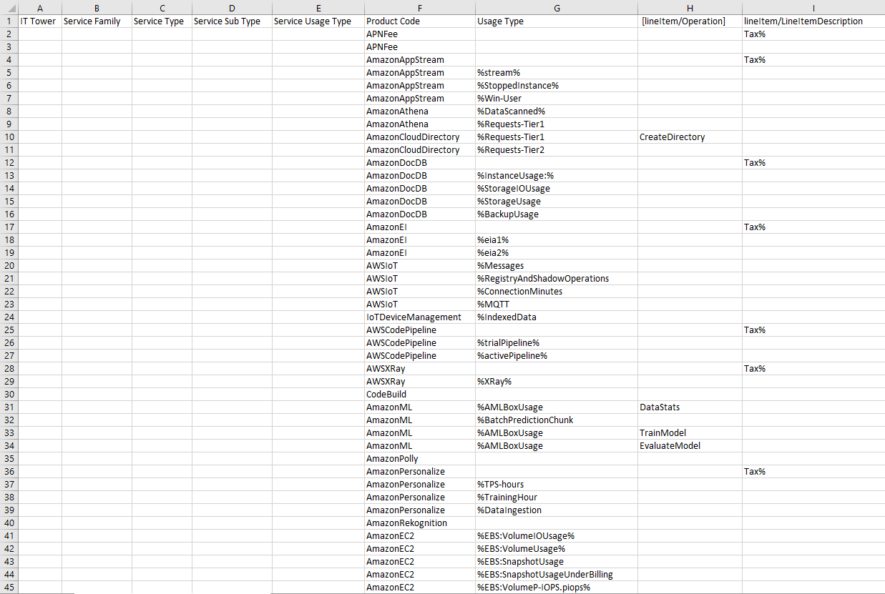
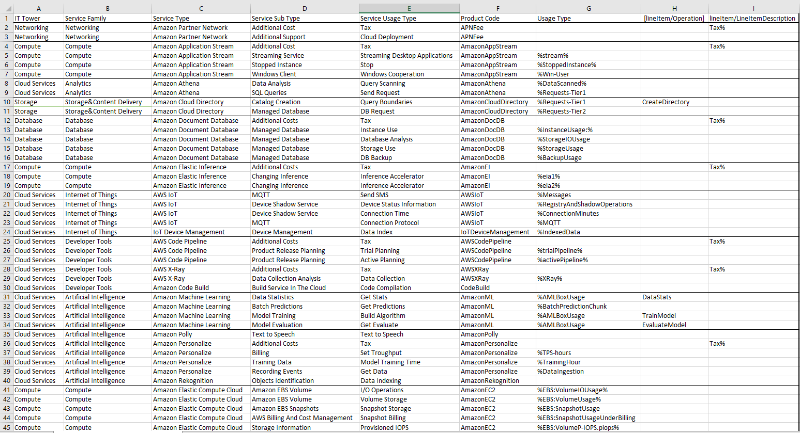

# Cloud лаба1 - Знакомство с IaaS, PaaS, SaaS сервисами в облаке на примере Amazon Web Services (AWS). Создание сервисной модели.

## Описание работы
### Цель работы
Знакомство с облачными сервисами. Понимание уровней абстракции над инфраструктурой в облаке. Формирование понимания типов потребления сервисов в сервисной-модели. 
### Дано 
- Слепок данных биллинга от провайдера после небольшой обработки в виде SQL-параметров. Символ % в начале/конце означает, что перед/после него может стоять любой набор символов.
- Образец итогового соответствия, что желательно получить в конце. В этом же документе  
### Необходимо 
- Импортировать файл .csv в Excel или любую другую программу работы с таблицами. Для Excel делается на вкладке Данные – Из текстового / csv файла – выбрать файл, разделитель – точка с запятой.
- Распределить потребление сервисов по иерархии, чтобы можно было провести анализ от большего к меньшему (напр. От всех вычислительных ресурсов Compute дойти до конкретного типа использования - Выделенной стойка в датацентре Dedicated host usage).
- Сохранить файл и залить в соответствующую папку на Google Drive.
### Алгоритм работы 
Сопоставить входящие данные от провайдера с его же документацией. Написать в соответствие колонкам справа значения 5 колонок слева, которые бы однозначно классифицировали тип сервиса. Для столбцов IT Tower и Service Family значения можно выбрать из образца.

## Ход работы 
1. Дан следующий слепок биллинга

2. С помощью документации AWS и гугла сопоставим данные и заполним первые пять столбцов

3. Опишем встреченные сервисы:
#### Amazon Partner Network
Это всемирная партнерская программа для компаний работающих с AWS, участники которой получают доступ к инструментам, обучению, маркетинговым ресурсам и поддержке для эффективной работы с AWS.
#### Amazon Application Stream
Это сервис, который позволяет удалённо запускать и предоставлять к доступ к приложениям через браузер (типа TeamViewer'а, но для приложений, а не рабочего стола).
#### Amazon Athena
Это сервис для выполнения SQL-запросов по данным, хранящимся в S3, без необходимости настройки серверов.
#### Amazon Cloud Directory
Это сервис для создания масштабируемых, многоуровневых каталогов данных. Он поддерживает гибкие схемы и упрощает управление большими объемами информации.
#### Amazon Document Database
Это управляемая база данных для JSON-документов, совместимая с MongoDB. Она предназначена для масштабируемых, надежных и высокопроизводительных документно-ориентированных приложений.
#### Amazon Elastic Inference
Это сервис, который добавляет ускорение на базе GPU к EC2 и SageMaker для более эффективного выполнения моделей машинного обучения. Позволяет снизить затраты, предоставляя только необходимую мощность GPU вместо выделенного экземпляра.
#### AWS Internet of Things
Это сервис для подключения, управления и анализа устройств интернета вещей. Поддерживает безопасную связь, обработку данных и интеграцию с другими сервисами AWS для создания IoT-приложений.
#### AWS Code Pipeline
Это сервис CI/CD для автоматизации процессов сборки, тестирования и развертывания приложений.
#### AWS X-Ray
Это сервис для анализа и отладки распределенных приложений. Он позволяет визуализировать запросы, выявлять узкие места и улучшать производительность микросервисов.
#### Amazon Code Build
Это сервис для непрерывной интеграции, который автоматически компилирует исходный код, запускает тесты и генерирует готовые артефакты для развёртывания.
#### Amazon Machine Learning
Это сервис, который упрощает создание, обучение и развёртывание моделей машинного обучения. Он поддерживает анализ данных, автоматизацию рабочих процессов и интеграцию с другими сервисами AWS для создания масштабируемых решений.
#### Amazon Polly
Это text-to-speech сервис, поддерживающий множество языков и голосов. Он подходит для создания голосовых приложений, аудиокниг и иных продуктов, имеет настройки тона и темпа речи.
#### Amazon Personalize
Это сервис для создания персонализированных рекомендаций и поиска. Он использует машинное обучение для анализа пользовательских данных и автоматического создания рекомендаций.
#### Amazon Rekognition
Это сервис для анализа изображений и видео с помощью машинного обучения. Он позволяет обнаруживать объекты, лица, сцены, текст и эмоции, а также сравнивать лица и модерировать неприемлемый контент.
#### Amazon Elastic Compute Cloud
Это сервис, предоставляющий масштабируемые виртуальные серверы для выполнения приложений в облаке. Он позволяет быстро запускать экземпляры, выбирать конфигурации процессоров, памяти и хранилища, а также оплачивать ресурсы по мере использования.

## Вывод
В ходе работы было осуществлено знакомство с облачными сервисами AWS, а также проведён анализ биллинга. Стало понятно, что Amazon предоставляет широкий выбор сервисов на все случаи жизни.
