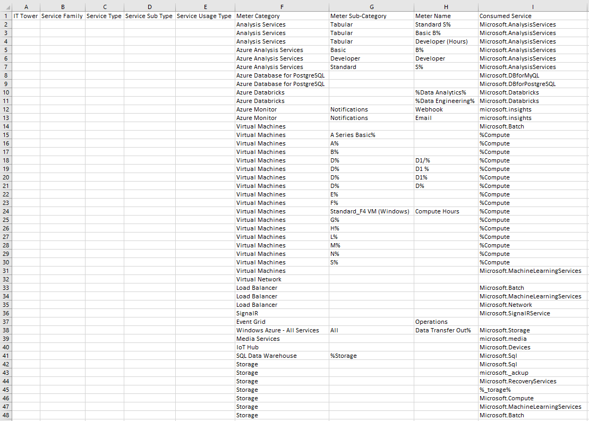
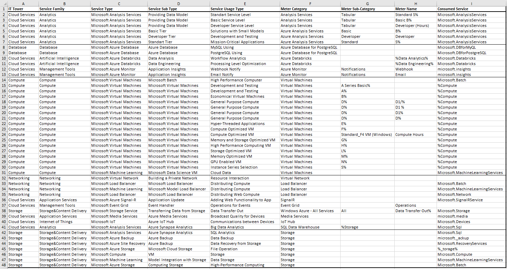

# Cloud лаба2 - Сравнение сервисов Amazon Web Services и Microsoft Azure. Создание единой кросс-провайдерной сервисной модели.

## Описание работы
### Цель работы
Получение навыков аналитики и понимания спектра публичных облачных сервисов без привязки к вендору. Формирование у студентов комплексного видения Облака.
### Дано 
- Данные лабораторной работы 1.
- Слепок данных биллинга от провайдера после небольшой обработки в виде SQL-параметров. Символ % в начале/конце означает, что перед/после него может стоять любой набор символов.
- Образец итогового соответствия, что желательно получить в конце. В этом же документе.
### Необходимо 
- Импортировать файл .csv в Excel или любую другую программу работы с таблицами. Для Excel делается на вкладке Данные – Из текстового / csv файла – выбрать файл, разделитель – точка с запятой.
- Распределить потребление сервисов по иерархии, чтобы можно было провести анализ от большего к меньшему (напр. От всех вычислительных ресурсов Compute дойти до конкретного типа использования - Выделенной стойка в датацентре Dedicated host usage). При этом сохранять логическую концепцию, выработанную в Лабораторной работе 1.
- Сохранить файл и залить в соответствующую папку на Google Drive.
### Алгоритм работы 
Сопоставить входящие данные от провайдера с его же документацией. Написать в соответствие колонкам справа значения 5 колонок слева, которые бы однозначно классифицировали тип сервиса. Для столбцов IT Tower и Service Family значения можно выбрать из образца. В ходе выполнения работы не отходить от принципов классификации, выбранных в Лабораторной работе 1. Например, если сервис Машинного обучения был разбит на Вычислительные мощности и Облачные сервисы, то продолжать его разбивать и в новых данных.

## Ход работы 
1. Дан следующий слепок биллинга

2. С помощью документации Azure и гугла сопоставим данные и заполним первые пять столбцов

3. Опишем встреченные сервисы:
#### Microsoft Analysis Services
Это платформа для анализа данных и создания моделей бизнес-аналитики. Поддерживаает обработку больших данных и интеграцию с Power BI и Excel.
#### Microsoft Azure Database
Это набор управляемых баз данных, включая MySQL и PostgreSQL. Обеспечивает высокую производительность, безопасность и масштабируемость.
#### Microsoft Azure Databricks
Это интегрированная аналитическая платформа для больших данных и искусственного интеллекта, созданная на базе Apache Spark. Она позволяет анализировать данные, разрабатывать и развертывать модели машинного обучения, плюс предоставляет интеграцию с Azure Data Lake и Power BI.
#### Microsoft Azure Monitor
Это сервис для мониторинга и управления производительностью приложений и ресурсов в Azure. Собирает метрики и логи, визуализирует данные через панели мониторинга и помогает быстрее обнаруживать проблемы с производительностью.
#### Microsoft Virtual Machines
Это облачный сервис, позволяющий создавать и управлять виртуальными машинами с различными конфигурациями и операционными системами. Предоставляет гибкость в настройке ресурсов, резервное копирование и масштабирование.
#### Microsoft Machine Learning
Это сервис для разработки, обучения и развертывания моделей машинного обучения. Поддерживает AutoML для автоматизации процесса построения моделей и интеграцию с такими инструментами, как Azure Databricks и Jupyter Notebook.
#### Microsoft Virtual Network
Это облачная служба, которая позволяет создавать изолированные сети. Поддерживает подключение VPN, настройку маршрутов, брандмауэры и безопасную интеграцию с локальной сетью.
#### Microsoft Load Balancer
Это сервис балансировки нагрузки для распределения входящего трафика на виртуальные машины и приложения. Он обеспечивает низкую задержку, высокую отказоустойчивость и интеграцию с автоматическим масштабированием.
#### Microsoft Azure Signal-R
Это сервис для реализации взаимодействий в реальном времени, например, чатов, уведомлений или обновлений данных. Используется в веб и мобильных приложениях для улучшения взаимодействия с пользователями.
#### Microsoft Event Grid
Это сервис маршрутизации событий между приложениями и сервисами. Используется для построения асинхронных систем, которые реагируют на обновления базы данных или завершение обработки файла.
#### Microsoft Media Services
Это платформа для обработки и трансляции медиа: кодирование и хранение, работа со стримами. Используется для создания видеоплатформ, онлайн-обучения и потоковых сервисов.
#### Microsoft IoT
Это набор инструментов для подключения и управления устройствами интернета вещей. Используется для мониторинга оборудования, анализа данных с датчиков и автоматизации процессов в умных устройствах.
#### Microsoft Azure Backup
Это сервис для автоматического резервного копирования данных и систем. Предоставляет защиту от атак и потери данных, а также упрощает их восстановление.
#### Microsoft Azure Storage
Это облачное хранилище для структурированных и неструктурированных данных. Используется для хранения больших объемов данных, файлов, резервных копий и данных для аналитики.

## Вывод
В ходе работы было осуществлено знакомство с облачными сервисами Microsoft Azure, а также проведён анализ биллинга. Стало понятно, что Microsoft, также как и Amazon, имеет целый ворох сервисов под любые нужды.
