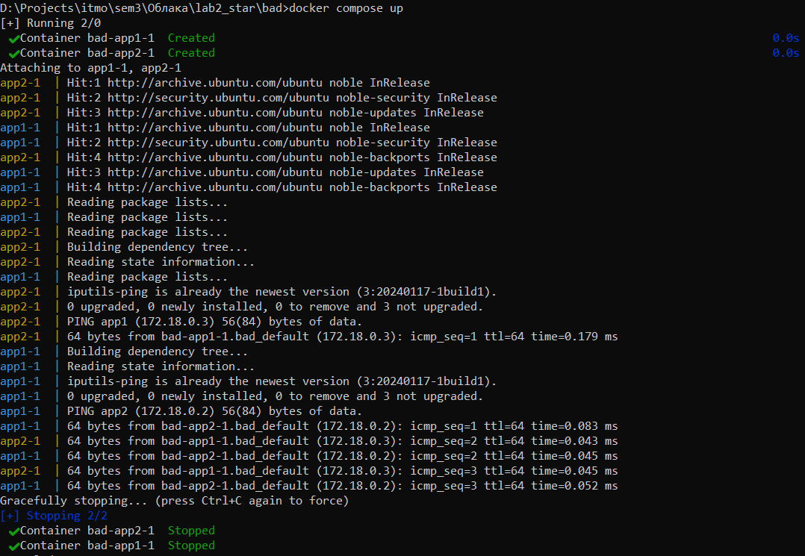
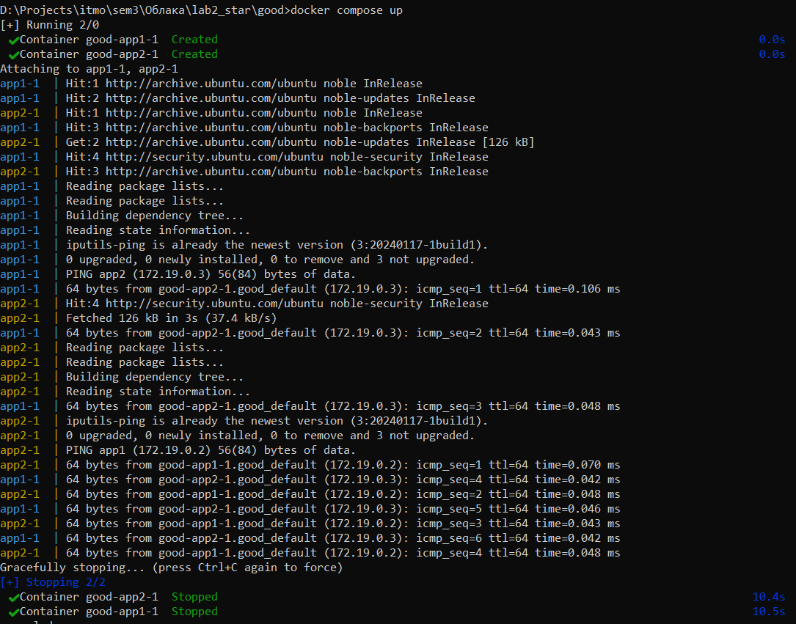
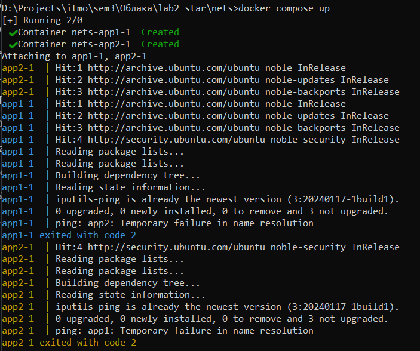

# DevOps лаба2* - работа с Docker Compose
### Требования:
- Написать “плохой” Docker Compose файл, в котором есть не менее трех “bad practices” по их написанию.
- Написать “хороший” Docker Compose файл, в котором эти плохие практики исправлены.
- В Readme описать каждую из плохих практик в плохом файле, почему она плохая и как в хорошем она была исправлена, как исправление повлияло на результат.
- После предыдущих пунктов в хорошем файле настроить сервисы так, чтобы контейнеры в рамках этого compose-проекта так же поднимались вместе, но не "видели" друг друга по сети. В отчете описать, как этого добились и кратко объяснить принцип такой изоляции.
## Docker Compose файл с Bad Practices
В этом файле создаются два сервиса `app1` и `app2`, которые пингуют друг друга, предварительно устанавливая `iputils-ping` для этого.
```
services:
  app1:
    image: ubuntu:latest
    command: bash -c "apt-get update && apt-get install -y iputils-ping && ping app2"
    privileged: true

  app2:
    image: ubuntu:latest
    command: bash -c "apt-get update && apt-get install -y iputils-ping && ping app1"
    privileged: true
    environment:
      - SECRET_KEY=12345
```
Проверим, корректно ли всё работает _(для скриншота запускал второй раз, поэтому ничего не скачивается)_. Используем команду `docker compose up` в директории с `.yml`-файлом.

## Исправленный Docker Compose файл 
```
services:
  app1:
    image: ubuntu:24.04
    command: bash -c "apt-get update && apt-get install -y iputils-ping && ping app2"
    privileged: false

  app2:
    image: ubuntu:24.04
    command: bash -c "apt-get update && apt-get install -y iputils-ping && ping app1"
    privileged: false
    environment:
      - SECRET_KEY=/run/secrets/secret_key

secrets:
  secret_key:
    file: ./secrets/secret_key.txt
```
Также запустим этот Docker Compose файл и проверим, что всё работает.

## Описание плохих практик и их исправлений
1. Использование `:latest` тегов.

При использовании тега `:latest` docker каждый раз будет пытаться загружать новую версию образа. Это может привести к нестабильности системы, особенно если образ будет содержать несовместимые изменения. Кроме того, из-за проверки актуальности версии замедляется развёртывание. Проблема была исправлена указанием конкретной версии образов в файле (`image: ubuntu:24.04`). Теперь проект будет более стабильным и будет быстрее развёртываться.

2. Запуск контейнеров с привилегиями.

Использование флага `privileged: true` предоставляет контейнеру полный доступ к ресурсам хоста, что не есть хорошо: ухудшается безопасность - потенциальный злоумышленник может получить контроль над хостом. Ситуаций, где может понадобиться данный флаг, не много, поэтому лучше привести его в состояние `false`, как и было сделано в "хорошем" Docker Compose файле. Так мы снизили риски безопасности.

3. Хранение секретов в переменных окружения.

Или иными словами - хардкодинг. Лучше таким не заниматься, потому что появляются риски утечки данных. Кроме того, усложняется изменение секретов - придётся лезть в код. Всё это исправляется использованием Docker secrets - хранением данных в отдельном файле, в данном случае это `./secrets/secret_key.txt`. Тем самым мы снова увеличили безопасность проекта.

## Сетевая настройка Docker Compose проекта
Как мы уже видели, контейнеры прекрасно пингуют друг друга, пора это исправлять. В другом Docker Compose файле добавим блок с объявлением сетей `networks:`. Кроме этого, подключим сервисы к разным сетям (`network1` и `network2`), теперь они изолированы друг от друга. По дефолту же контейнеры находятся в одной сети, поэтому могут пинговаться.
```
services:
  app1:
    image: ubuntu:24.04
    command: bash -c "apt-get update && apt-get install -y iputils-ping && ping app2"
    privileged: false
    networks:
      - network1

  app2:
    image: ubuntu:24.04
    command: bash -c "apt-get update && apt-get install -y iputils-ping && ping app1"
    privileged: false
    environment:
      - SECRET_KEY=/run/secrets/secret_key
    networks:
      - network2

secrets:
  secret_key:
    file: ./secrets/secret_key.txt

networks:
  network1:
    driver: bridge
  network2:
    driver: bridge
```
Также проверим, работает ли всё так, как задумано.


Возникает ошибка `Temporary failure in name resolution`. Она указывает на то, что контейнеры находятся в разных сетях и не могут видеть друг друга. Значит всё работает, как и должно, супер.
