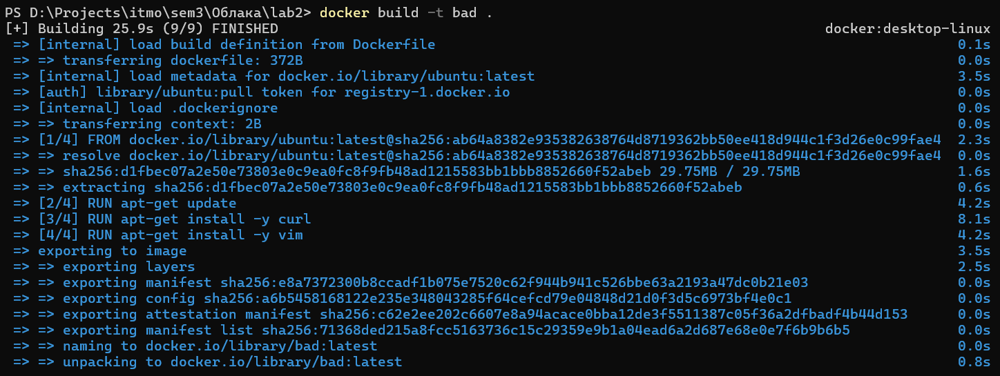
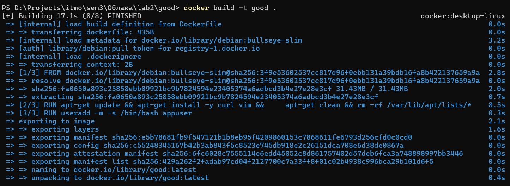
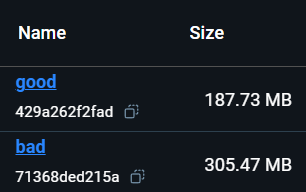
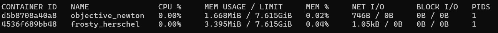

# DevOps лаба2 - работа с Dockerfile
### ТЗ:
- Написать “плохой” Dockerfile, в котором есть не менее трех “bad practices” по написанию докерфайлов.
- Написать “хороший” Dockerfile, в котором эти плохие практики исправлены.
- В Readme описать каждую из плохих практик в плохом докерфайле, почему она плохая и как в хорошем она была исправлена, как исправление повлияло на результат.
- В Readme описать 2 плохих практики по работе с контейнерами. ! Не по написанию докерфайлов, а о том, как даже используя хороший докерфайл можно накосячить именно в работе с контейнерами.


## Dockerfile с Bad Practices
```
# Использование большого базового образа
FROM ubuntu:latest  

# Использование root-пользователя
USER root  

# Отсутствие группировки команд
RUN apt-get update  
RUN apt-get install -y curl  
RUN apt-get install -y vim  

CMD ["bash"]
```
## Исправленный Dockerfile
```
# Используем небольшой базовый образ
FROM debian:bullseye-slim  

# Группируем команды
RUN apt-get update && apt-get install -y curl vim && \
    apt-get clean && rm -rf /var/lib/apt/lists/*

# Создаём и используем нового пользователя
RUN useradd -m -s /bin/bash appuser  
USER appuser  

CMD ["bash"]
```
## Описание плохих практик и их исправлений
1. **Использование большого базового образа.**

   В таких образах содержится много лишних библиотек, которые не используются в контейнерах, но при этом увелечивают размер докерфайла. Кроме того, они замедляют загрузку и разввёртывание контейнеров, а также несут в себе множество потенциальных уязвимостей.
   Поэтому лучше использовать более лёгкие образы, содержащие только необходимые пакеты, как например `debian:bullseye-slim`. При их использовании все вышеописанные проблемы сходят не нет: улучшается производительность и безопасность контейнеров. 
2. **Использование `root`-пользователя.**

   Думаю понятно, что использовать `root` там, где этого не требуется, не стоит, так как это ведёт к дырам в безопасности.
   В исправленном докерфайле создаётся новый пользователь (+ указывается использование bash-оболочки для него). Теперь потенциальные злоумышленники не смогут выполнять команды от имени `root`.
3. **Отсутствие группировки команд.**

   Каждая команда создаёт новый слой. Не группироввать их - плохо, потому что от этого увеличивается размер и снижается производительность контейнеров.
   В данном случае используем один RUN для объединения слоёв. Кроме того, в "хорошем" докерфайле для уменьшения размера контейнера была добавлена очистка кэша и временных файлов, появляющихся после использования команд `apt-get`.

Попробуем собрать Docker images и запустить контейнеры.




_На последнем скриншоте первый контейнер - "хороший", второй - "плохой"._

Видим, что исправленный докерфайл собирается быстрее и весит практически в 2 раза меньше. Кроме этого, контейнер, запущенный из "хорошего" образа потребляет вдвое меньше ОЗУ.

## Bad Practices по работе с контейнерами.
1. **Запуск контейнеров без ограничения ресурсов**

   Если явно не указывать ограничения при запуске контейнера, то появляется риск заполнения всего ресурса процессора и памяти машины. Это может повлечь за собой сбои в работе других программ и контейнеров. Поэтому нужно явно прописывать ограничения при запуске.

2. **Не очищать неиспользуемые образы и контейнеры.**

   После частых развертываний остаются остановленные контейнеры. Если в них нет нужды в будущем, то они будут только занимать место на машине. Кроме того, ориентироваться в огромной куче данных (к тому же непонятно, нужных или нет) будет сложнее. Поэтому лучше периодически проводить чистки неиспользуемых контейнеров.
