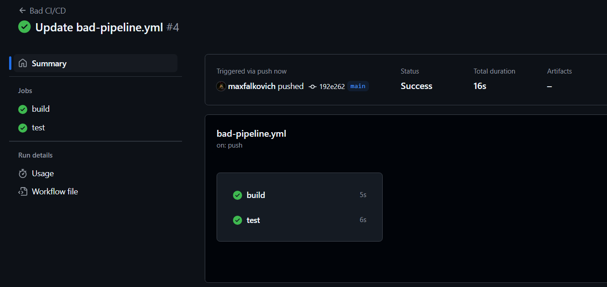
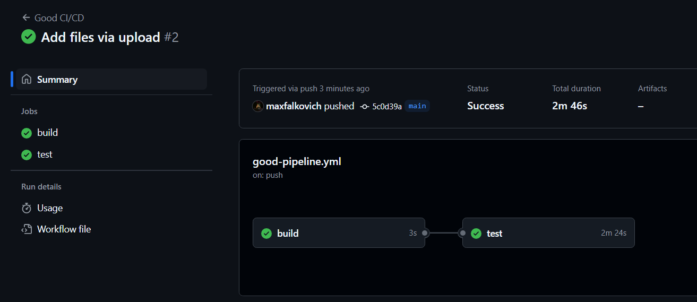
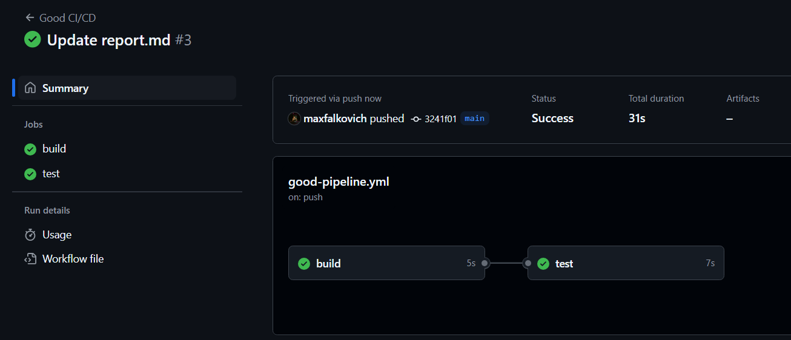

# DevOps лаба3 - CI/CD
### Требования:
- Написать “плохой” CI/CD файл, который работает, но в нем есть не менее пяти “bad practices” по написанию CI/CD
- Написать “хороший” CI/CD, в котором эти плохие практики исправлены
- В Readme описать каждую из плохих практик в плохом файле, почему она плохая и как в хорошем она была исправлена, как исправление повлияло на результат
- Прочитать историю про Васю (она быстрая, забавная и того стоит): https://habr.com/ru/articles/689234/
## Описание работы
При каждом пуше в `main` запускаются GitHub Actions workflows, которые выполняют билд и тест программы `main.py` (сложение двух чисел).
## CI/CD файл с Bad Practices
```
name: Bad CI/CD

on:
  push:
    branches:
      - main

jobs:
  build:
    runs-on: ubuntu-latest
    steps:
      - uses: actions/checkout@v4
      - run: |
          cd lab3
          mkdir build
          cp main.py build/main.py

  test:
    runs-on: ubuntu-latest
    steps:
      - uses: actions/checkout@v4
      - uses: actions/setup-python@v4
        with:
          python-version: 3.12
      - run: |
          cd lab3
          python -m pip install --upgrade pip
          pip install pytest
      - run: |
          cd lab3
          pytest test_main.py
```
Проверим, корректно ли всё работает.

## Исправленный CI/CD файл
```
name: Good CI/CD

on:
  push:
    branches:
      - main

jobs:
  build:
    runs-on: ubuntu-22.04
    steps:
      - name: Checkout code
        uses: actions/checkout@v4
      - name: Build project
        run: |
          cd lab3
          mkdir build
          cp main.py build/main.py

  test:
    runs-on: ubuntu-22.04
    needs: build
    timeout-minutes: 5
    steps:
      - name: Checkout code
        uses: actions/checkout@v4
      - name: Set up Python
        uses: actions/setup-python@v4
        with:
          python-version: 3.12
          cache: 'pip'
      - name: Install dependencies
        run: |
          cd lab3
          python -m pip install --upgrade pip
          pip install pytest
      - name: Run tests
        run: |
          cd lab3
          pytest test_main.py
```
Всё также работает. Единственное, что `test` в первый раз очень долго выполнялся из-за кэширования:


Дальше — быстрее:

## Описание плохих практик и их исправлений
1. **Использование `ubuntu-latest`.**

   `latest` версия периодически меняется, это может привести к неожиданным проблемам совместимости. Также, проверка актуальной версии занимает время, то есть замедляет все процессы, хоть и незначительно. Верным решением будет использовать конкретную версию, например, `ubuntu-22.04` — это повысит стабильность и скорость всех работ.
2. **Отсутствие подписей к шагам.**

   Без подписей восприятие действий каждого шага не такое быстрое, к тому же автоматически сгенерированные подписи в GitHub Actions выглядят не так красиво. Пропишем явно описания после `name:` — теперь читать CI/CD файл стало намного приятнее.
3. **Отсутствие связей между jobs "build" и "test".**

   Связи между jobs никак не прописаны, а они должны быть. Добавим `needs: build`, чтобы тестирование начиналось только после билда.
4. **Отсутствие кэширования.**

   Отсутствие кэширования ведёт к повторной установке зависимостей и замедлению всего процесса. Добавим же его: `cache: 'pip'`. Теперь в теории всё должно выполняться быстрее.
5. **Отсутствие ограничения времени выполнения задач.**

   По разным причинам может возникнуть ситуация, когда работа будет выполняться слишком долго. Этого нам не надо, поэтому добавим таймаут: `timeout-minutes: 5`. Теперь, в случае чего workflow завершится за адекватное время.
